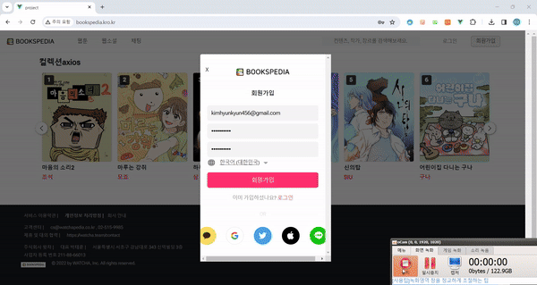
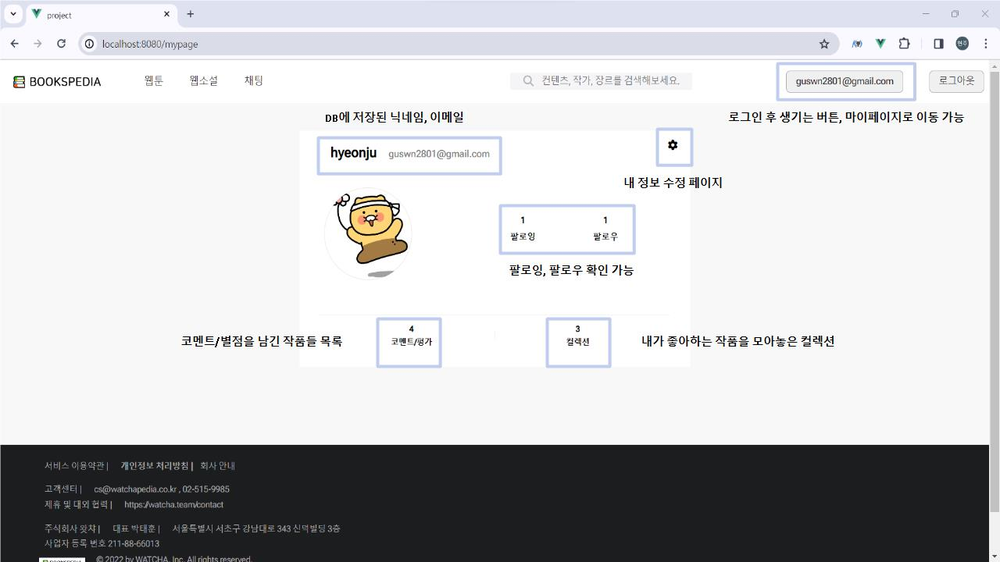
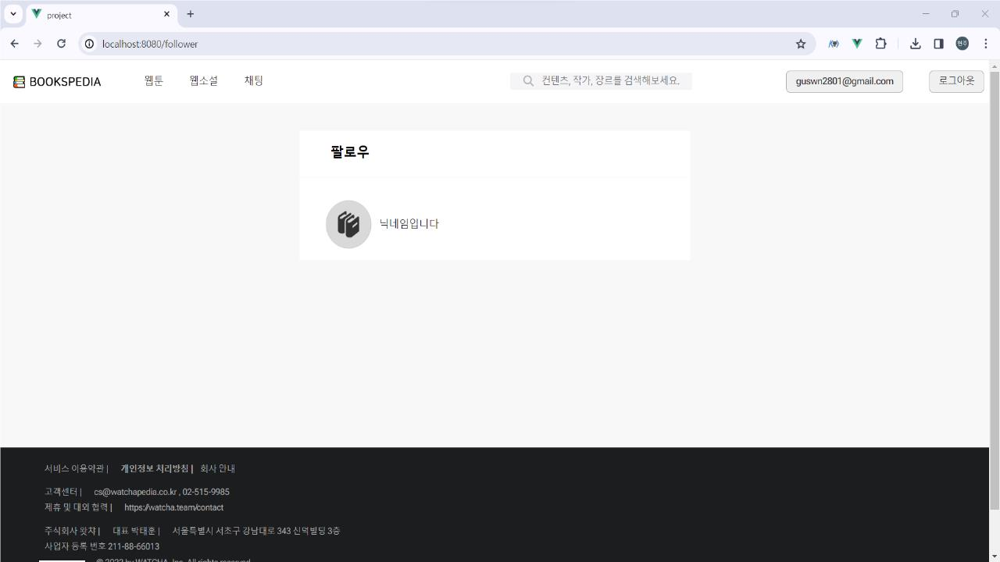
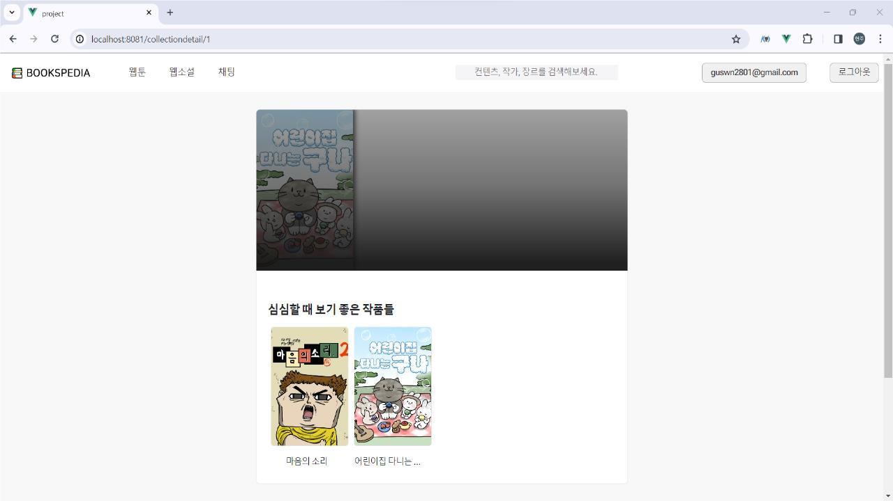
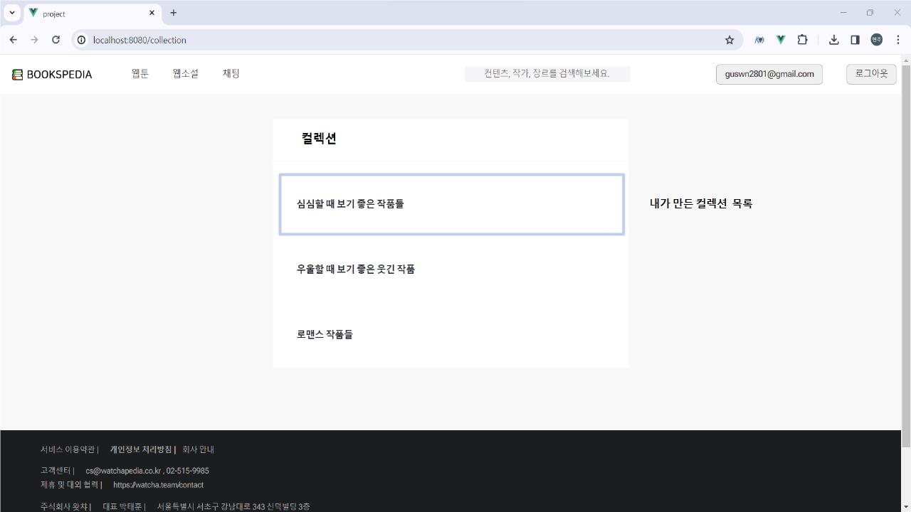
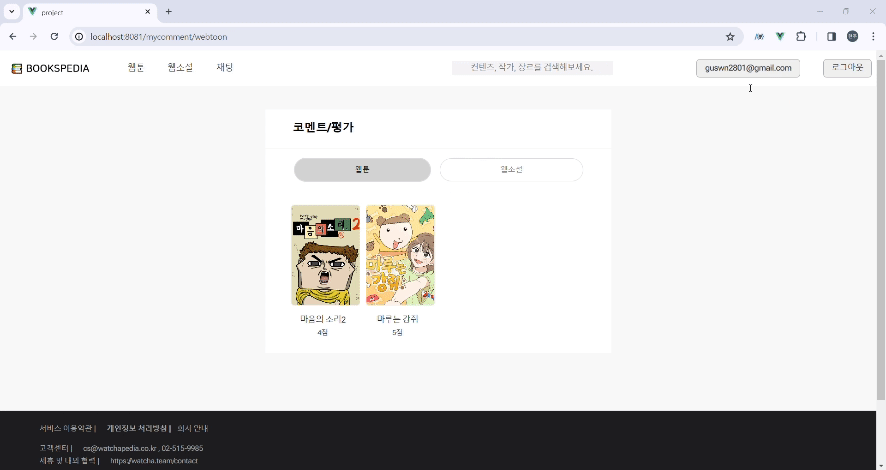
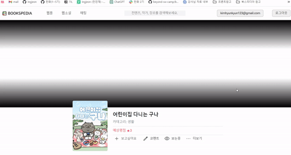
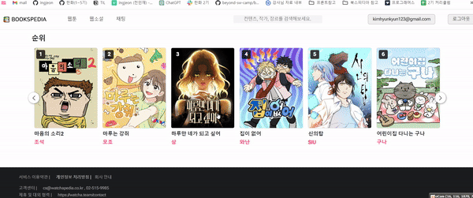
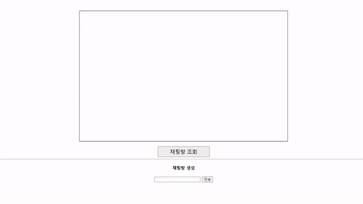

<h1 align="center"> BOOKSPEDIA 👍</h1>

  

> [플레이 데이터] 한화시스템 BEYOND SW캠프 / HJHG..

 

## ✨ 프로젝트 설명

<h5><a href="http://www.bookspedia.kro.kr">BOOKSPEDIA 바로가기</a></h5>
<h5><a href="https://github.com/beyond-sw-camp/be02-2nd-hjhgteam-book">백엔드 바로가기</a></h5>

저희 서비스는 사용자가 본 웹툰/웹소설에 대해 별점 및 리뷰를 남기고 컬렉션을 만들어 공유할 수 있습니다.
또한 매주 새롭게 올라오는 회차에 대한 라이브톡을 진행하여 독자 모두가 모여 이야기하며 작품에 대한 감상을 나눌 수 있습니다.

## 📌 시스템 아키텍쳐

## 🔍 STACKS

## 기능 명세서

<h5><a href="https://www.figma.com/file/1dumt0bPpq0bd4EnRjJQ38/BOOKSPEDIA-%EA%B8%B0%EB%8A%A5-%EC%A0%95%EC%9D%98%EC%84%9C-%26-%ED%99%94%EB%A9%B4-%EC%84%A4%EA%B3%84%EC%84%9C?type=design&node-id=0-1&mode=design&t=b7Xl4VmXvo3g0DxN-0">figma 바로가기</a></h5>

## 프로젝트 시연 영상

  
 프로젝트 시연

  

    
 회원가입 

### 회원가입

  

  

    
 로그인 & 로그아웃 

### 로그인 & 로그아웃

  

  

    
 마이페이지 

### 마이페이지
  

  

  

    
 마이페이지 수정 

### 마이페이지 수정

  
  
  

  

  

    
 팔로우 & 팔로잉 

### 팔로우 & 팔로잉
  
  

  

  

    
 컬렉션 

### 컬렉션
  
  

  

  
  

    
 코멘트 

### 코멘트
  

  

  

    
 메인화면 

### 메인화면
  

  

  

    
 작품 코멘트 생성

### 작품 코멘트 생성
  

  

  

    
 작품 코멘트 더보기 

### 작품 코멘트 더보기
  

  

  

    
 작품 코멘트 삭제 

### 작품 코멘트 삭제
  

  

  

    
 채팅 

### 채팅
  

  

## 🤼‍♂️팀원

Team : 🐯 김현균

Team : 🐺 이주현

Team : 🐱 전민재

Team : 🦁 홍현주

##
